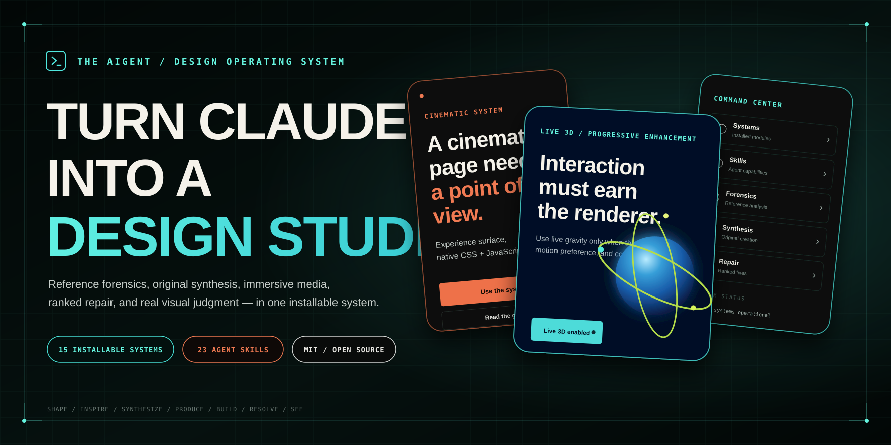

<p align="center">
  
</p>

# Aigent

**Turn the coding agent you already use into a professional design studio.**

Aigent is an agent-native design operating system for building polished websites, immersive sales decks, product interfaces, motion systems, and 3D experiences. It installs into Claude Code, Codex, or another capable coding agent and gives that agent the design doctrine, specialist skills, production routes, browser QA, visual critique, and refinement loops in this repository.

There is no separate IDE to learn. Aigent works inside the agent and codebase you already use.

## The idea

```text
YOU
“Build a cinematic launch site for an industrial robotics company. Use Aigent.”

        ↓

AIGENT
Shape the brief
→ develop visual directions
→ establish Design DNA
→ choose typography / layout / motion
→ source or create assets
→ build the real project
→ inspect it in the browser
→ run Taste + Resolve + Vision
→ repair root causes
→ polish

        ↓

A REAL, EDITABLE PROJECT
```

Aigent is not a component library that makes every site look the same. The system is designed to help an agent reason like a strong creative director, visual designer, motion designer, frontend engineer, and QA reviewer while preserving the user's product truth and codebase.

## Install

### Claude Code

Install the repository's primary design skill into the project you want Claude Code to work on:

```bash
pnpm dlx shadcn@latest add wrg32786/aigent-design-system/aigent-design-skill
```

Then ask Claude Code naturally:

```text
Use Aigent to build a premium launch site for my product.
Develop distinct visual directions first, recommend one, then build it.
```

### Codex and other coding agents

The same Aigent skill and reference material can be used by Codex or another agent that can read repository instructions and edit the project. Point the agent at the installed `aigent-design` skill and tell it to use Aigent for the design/build task.

The architecture deliberately keeps provider-specific integration thin: **Aigent Core owns the design intelligence; the coding agent supplies the model, tools, and code-editing environment.**

## How you use it

You should be able to speak normally rather than memorize commands:

```text
Build a cinematic site for this product. Use Aigent.

Make the hero less generic.

Use these three sites as inspiration, but don't copy them.

Make it bolder.

The mobile version feels cramped. Fix it.

Add one memorable interaction without turning it into a demo reel.

Polish the whole thing and inspect the rendered result before you're done.
```

Aigent's master skill routes those requests to the specialist knowledge that owns them. You do not need to manually orchestrate every subsystem.

## Default creative loop

```text
SHAPE → INSPIRE → SYNTHESIZE → PRODUCE → BUILD → TASTE → RESOLVE → SEE → POLISH
```

- **Shape** — understand the product, audience, proof, mechanism, and desired outcome.
- **Inspire** — inspect references and extract transferable design principles.
- **Synthesize** — combine multiple influences into an original visual direction.
- **Produce** — source or create imagery, video, 3D, textures, illustration, and motion assets.
- **Build** — implement the real site, deck, interface, or experience in the user's codebase.
- **Taste** — catch deterministic generated-design defaults and craft-floor violations.
- **Resolve** — measure the actual browser and repair mechanical failures at their source.
- **See** — inspect rendered captures and make structured visual judgments.
- **Polish** — fix the highest-value hierarchy, typography, spacing, media, motion, responsive, and interaction issues before completion.

For substantial new work, Aigent should develop multiple viable visual directions before committing to one. The first render is not considered finished.

## What Aigent can create

| System | Best for |
| --- | --- |
| [`templates/modular-scroll-starter/`](templates/modular-scroll-starter/) | Cinematic landing pages and product stories |
| [`templates/immersive-sales-deck/`](templates/immersive-sales-deck/) | Sales decks, sponsorship decks, launches, and presentations |
| [`templates/command-center-interface/`](templates/command-center-interface/) | Dashboards, editors, resource systems, and operator tools |
| [`templates/threejs-product-stage/`](templates/threejs-product-stage/) | Interactive 3D product experiences with complete fallbacks |
| [`templates/free-design-stack/`](templates/free-design-stack/) | Pinned video narratives |
| [`templates/spline-scroll-landing/`](templates/spline-scroll-landing/) | Spline and GSAP 3D landing pages |
| [`templates/asset-scroll-gallery/`](templates/asset-scroll-gallery/) | Editorial media and resource galleries |
| [`vault/`](vault/) | Reusable visual and interaction systems |
| [`inspiration/lab/`](inspiration/lab/) | Multi-reference synthesis and Design DNA |

Templates are starting systems, not mandatory visual styles. Aigent should adapt to the product and references rather than force every project through one house look.

## The design brain

The primary [`aigent-design`](skills/aigent-design/SKILL.md) skill is the router. It owns the end-to-end design contract and loads specialist knowledge only when needed.

```text
shape · inspire · create · page · deck · interface · asset
layout · typeset · color · animate · critique · polish
resolve · vision · publish · audit · extract · eval
```

Important supporting systems include:

- **Design doctrine and craft floor** — hierarchy, composition, typography, media, motion, responsive behavior, accessibility, and anti-patterns.
- **Inspiration Intelligence** — reference forensics, Design DNA, multi-source matrices, and influence ledgers.
- **Aigent Taste** — deterministic checks for common generated-design failures.
- **Aigent Resolve** — browser-measured QA across desktop, tablet, mobile, zoom, reduced motion, focus, overflow, runtime errors, media, and requests.
- **Aigent Vision** — rendered screenshot review and structured visual judgment.
- **Creative production** — images, video, Three.js, Blender, Spline, Rive, GSAP, Remotion, HyperFrames, and native browser capture when the project earns them.
- **Publishing** — constrained export and deployment guidance when the user wants to ship.

## Creative refinement

Aigent understands plain-language refinement such as:

- **Bolder** — strengthen hierarchy, composition, typography, media, and one focal interaction without adding generic visual noise.
- **Quieter** — remove decorative competition and unnecessary effects while preserving the strongest idea.
- **Delight** — add one or two purposeful moments of interaction or continuity rather than decoration for its own sake.
- **Polish** — perform the final professional pass across hierarchy, spacing, typography, responsive behavior, media, motion, and states.

These are creative intentions, not separate products or UI modes.

## Browser and visual QA

Aigent should not stop because the code compiles.

The quality loop is:

```text
code
→ render in browser
→ inspect real geometry and runtime behavior
→ capture desktop / tablet / mobile
→ run Taste + Resolve
→ inspect the images with Vision
→ rank the important failures
→ repair shared root causes
→ rerender
```

The repository includes the browser and visual-review tooling needed for that loop. A capable agent can invoke it directly; a separate Aigent IDE is not required.

## Optional specialist installs

The master skill is the normal starting point. Specialist systems remain independently installable for advanced users and contributors.

### Inspiration Intelligence

```bash
pnpm dlx shadcn@latest add wrg32786/aigent-design-system/inspiration-intelligence
```

### Aigent Resolve

```bash
pnpm dlx shadcn@latest add wrg32786/aigent-design-system/design-resolver
npm run resolve:check
```

### Aigent Vision

```bash
pnpm dlx shadcn@latest add wrg32786/aigent-design-system/vision-critic
npx github:wrg32786/aigent-design-system vision prepare --target .
```

### Publishing

```bash
pnpm dlx shadcn@latest add wrg32786/aigent-design-system/publish-site
```

## Repository structure

```text
skills/                agent skills and specialist design knowledge
creative-production/   asset, motion, video, 3D, and media workflows
inspiration/           reference analysis and synthesis
resolve/               browser-measured QA
vision/                rendered visual review
publish/               constrained export and deployment
patterns/              reusable design and interaction patterns
templates/             starting systems for different experience types
vault/                 reusable systems and examples
tokens/                design tokens
```

The former Desktop/Studio application is no longer the product direction. Aigent is intentionally centered on the coding agent rather than maintaining a second IDE, provider-auth layer, installer, updater, and project manager.

## Verification

For contributors working on the Aigent core:

```bash
npm install
npm run check
npm run registry
npm run intelligence
npm run inspiration
npm run inspiration:smoke
npm run resolve:check
npm run vision:check
npm run publish:check
npm run eval
```

Desktop and Studio application checks are intentionally not part of the agent-native product contract.

## Principles

1. **Use the user's existing coding agent.** Do not rebuild Claude Code, Codex, or another IDE.
2. **Design before decorating.** Establish hierarchy, composition, typography, media, and interaction intent before effects.
3. **Show directions before commitment.** Substantial greenfield work should explore multiple viable visual worlds.
4. **Use references as evidence, not templates.** Extract principles and synthesize rather than copy.
5. **The browser is ground truth.** Measure and inspect the rendered result.
6. **First render is not final.** Taste, Resolve, Vision, and polish are part of completion.
7. **Root-cause repair over patch piles.** Fix shared sources when possible.
8. **Use advanced media only when it earns its cost.** 3D, video, and heavy motion need a product reason.
9. **Preserve accessibility and reduced-motion meaning.** Craft does not excuse broken interaction.
10. **Keep Aigent provider-agnostic.** The design intelligence should not depend on one model vendor.

## Security

Aigent does not need to own AI credentials. Authentication stays with the coding agent the user already chose. Publishing and production tooling should continue to exclude environment files, private keys, certificates, agent state, and credential-shaped content from public exports.

Read [`SECURITY.md`](SECURITY.md) for the repository's detailed boundaries.

## License

MIT for Aigent-authored code and documentation. Third-party tools and assets retain their own licenses; see [`THIRD_PARTY.md`](THIRD_PARTY.md).
