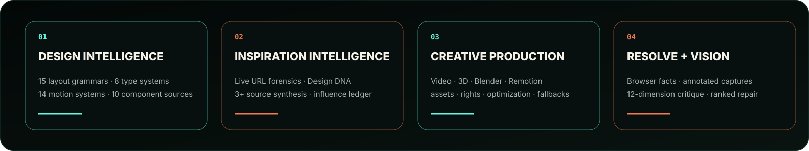
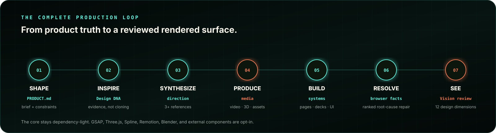
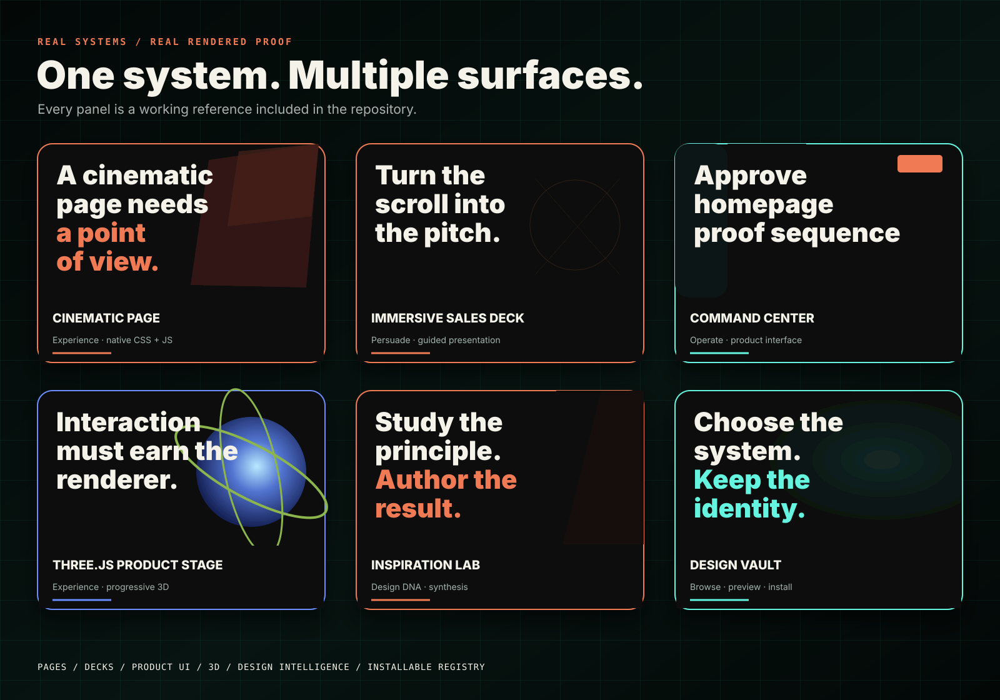
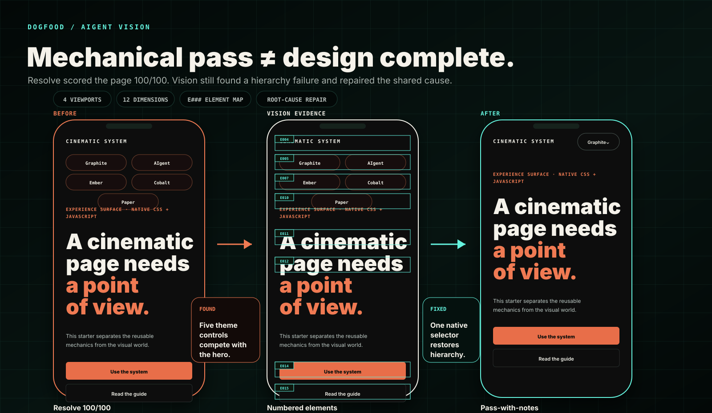

<p align="center">
  
</p>

<h1 align="center">AIgent Design System</h1>

<p align="center"><strong>An agent-native design and production studio for distinctive interfaces, immersive 3D websites, cinematic decks, and the media behind them.</strong></p>

<p align="center">
  <a href="https://github.com/wrg32786/aigent-design-system/releases/tag/v0.5.0">v0.5.0</a>
  · <a href="https://theaigent.xyz">The AIgent</a>
  · <a href="https://tools.theaigent.xyz">AIgent Tools</a>
  · <a href="#see-what-it-builds">Reference systems</a>
  · <a href="#license">MIT</a>
</p>

AIgent turns Claude, Codex, Cursor, and other coding agents into a disciplined design-and-production team. It does not stop at styling: it studies references, synthesizes an original direction, finds or produces the media, builds the surface, measures the browser, sees the rendered result, and repairs the highest shared cause.

```text
SHAPE → INSPIRE → SYNTHESIZE → PRODUCE → BUILD → RESOLVE → SEE
```

### Install the complete studio

```bash
pnpm dlx shadcn@latest add wrg32786/aigent-design-system/full-studio
```

The neutral core remains framework- and dependency-light. GSAP, Three.js, Spline, Remotion, Rive, React Three Fiber, Theatre.js, Blender, FFmpeg, and external component sources are opt-in and used only when the work earns them.

<p align="center">
  
</p>

## The complete loop

<p align="center">
  
</p>

| Stage | What the agent does | Durable output |
| --- | --- | --- |
| **Shape** | Defines the job, audience, proof, states, and constraints | `PRODUCT.md` + design brief |
| **Inspire** | Inspects URLs, screenshots, video, motion, and structured references | Design DNA + evidence |
| **Synthesize** | Combines at least three references without letting one source control the result | reference matrix + influence ledger |
| **Produce** | Sources, generates, renders, clears, and optimizes video, 3D, textures, posters, and sequences | assets + manifests + fallbacks |
| **Build** | Installs and adapts the smallest useful page, deck, interface, pattern, or runtime | working surface |
| **Resolve** | Measures desktop, tablet, mobile, text zoom, reduced motion, runtime, access, and performance | ranked mechanical repair contract |
| **See** | Opens original and annotated captures and judges twelve design dimensions | structured Vision review |

## See what it builds

<p align="center">
  
</p>

These are working reference systems, not mood-board promises:

| System | Best for | Install |
| --- | --- | --- |
| [`templates/modular-scroll-starter/`](templates/modular-scroll-starter/) | Brand-neutral cinematic page | `cinematic-page` |
| [`templates/immersive-sales-deck/`](templates/immersive-sales-deck/) | Sales, sponsorship, launch, and guided presentations | `immersive-sales-deck` |
| [`templates/command-center-interface/`](templates/command-center-interface/) | Operator tools, dashboards, and dense product UI | `command-center-interface` |
| [`templates/threejs-product-stage/`](templates/threejs-product-stage/) | Progressive interactive 3D | `threejs-product-stage` |
| [`templates/free-design-stack/`](templates/free-design-stack/) | Pinned video narratives | included reference |
| [`templates/spline-scroll-landing/`](templates/spline-scroll-landing/) | Visually authored 3D pages | included reference |
| [`templates/asset-scroll-gallery/`](templates/asset-scroll-gallery/) | Editorial resource and media galleries | included reference |
| [`vault/`](vault/) | Browse, preview, and install systems | `design-vault` |

```bash
pnpm dlx shadcn@latest add wrg32786/aigent-design-system/cinematic-page
pnpm dlx shadcn@latest add wrg32786/aigent-design-system/immersive-sales-deck
pnpm dlx shadcn@latest add wrg32786/aigent-design-system/command-center-interface
pnpm dlx shadcn@latest add wrg32786/aigent-design-system/threejs-product-stage
```

## The agent now has eyes

AIgent Resolve supplies browser facts. **AIgent Vision** supplies structured rendered judgment.

<p align="center">
  
</p>

The first dogfood run found a real issue that Resolve missed: five mobile theme controls dominated the hero even though the page scored `100/100` mechanically. Vision connected the visual failure to the shared theme-control primitive; the repair replaced the row with one compact native selector while preserving keyboard access, theme switching, the 44px target, and the desktop control set.

Vision reviews every required original and annotated capture across:

`product clarity · hierarchy · composition · typography · color/material · motion/media · interaction · product specificity · originality · responsive quality · trust/usability · finish`

Each finding records visible evidence, P0–P3 severity, relevant `E###` elements, suspected shared owner, concrete repair, confidence, and what must be preserved. A screenshot existing on disk is not accepted as proof that the agent looked at it.

```bash
npx github:wrg32786/aigent-design-system resolve \
  --target . \
  --url http://127.0.0.1:3000/

npx github:wrg32786/aigent-design-system vision prepare --target .

npx github:wrg32786/aigent-design-system vision check \
  --target . \
  --review .aigent/resolve/latest.visual-review.json

npx github:wrg32786/aigent-design-system vision finalize \
  --target . \
  --review .aigent/resolve/latest.visual-review.json
```

The specialist skill is [`visual-design-critic`](skills/visual-design-critic/SKILL.md). The generated review lives at `.aigent/resolve/latest.visual-review.json` and is merged with the mechanical Resolve report into one repair queue.

## Start with the smallest useful install

### Studio core

Product and design contracts, semantic tokens, native motion, the consolidated agent skill, and deterministic planning.

```bash
pnpm dlx shadcn@latest add wrg32786/aigent-design-system/studio-core
```

### Inspiration Intelligence

URL and file forensics, Design DNA, multi-source synthesis, originality review, influence ledger, and Inspiration Lab.

```bash
pnpm dlx shadcn@latest add wrg32786/aigent-design-system/inspiration-intelligence
```

### Design Resolver

Mechanical render, detect, rank, repair, rerender, and comparison loop. It installs Vision Critic as a dependency.

```bash
pnpm dlx shadcn@latest add wrg32786/aigent-design-system/design-resolver
```

### AIgent Vision Critic

Annotated captures, element maps, structured aesthetic critique, visual comparison, and the combined completion gate.

```bash
pnpm dlx shadcn@latest add wrg32786/aigent-design-system/vision-critic
```

Review any registry item before installation:

```bash
pnpm dlx shadcn@latest view wrg32786/aigent-design-system/inspiration-intelligence
pnpm dlx shadcn@latest add wrg32786/aigent-design-system/inspiration-intelligence --dry-run
```

## One primary skill, specialist depth

```bash
pnpm dlx shadcn@latest add wrg32786/aigent-design-system/aigent-design-skill
```

The consolidated [`aigent-design`](skills/aigent-design/SKILL.md) skill is the single entry point:

```text
shape      define product truth and the design brief
inspire    inspect references and synthesize an original direction
create     create or replace a complete visual world
page       build a marketing, editorial, or experience surface
deck       build an immersive sales or presentation deck
interface  build product UI with complete states
asset      source, generate, render, optimize, and manifest media
layout     repair hierarchy, grouping, density, and responsiveness
typeset    establish role-based typography
color      establish palette, material, contrast, and semantic roles
animate    author focal motion and useful state transitions
critique   identify the highest-value design failures
polish     finish an already working surface
resolve    run the mechanical render-and-repair loop
vision     inspect rendered captures and write structured critique
audit      run design, browser, inspiration, asset, registry, and rights checks
extract    promote proven work into a reusable system
install    choose the smallest useful internal or external system
eval       score a result without fabricating visual judgment
```

Specialist skills own design forensics, reference synthesis, originality review, video, 3D, GSAP, Spline, Three.js, Remotion, provenance, Resolve, Vision, and final browser QA.

<details>
<summary><strong>How Inspiration Intelligence works</strong></summary>

### Capture a live URL

```bash
npx github:wrg32786/aigent-design-system inspire add \
  https://example.com \
  --label example
```

The URL pipeline captures desktop, tablet, and mobile screenshots; full-page and scroll-filmstrip states; visible DOM hierarchy and geometry; computed typography and materials; sticky and fixed regions; media and interaction evidence; Web Animations timing; Chrome DOMSnapshot data; responsive transformations; and browser errors.

It stores local evidence under `.aigent/inspiration/`, which is ignored by Git.

### Add files

```bash
npx github:wrg32786/aigent-design-system inspire add reference.png
npx github:wrg32786/aigent-design-system inspire add reference.mp4
npx github:wrg32786/aigent-design-system inspire add reference.json \
  --kind structured-reference \
  --analysis reference.json
```

### Compose an original direction

Whole-surface synthesis requires at least three references. No source may control more than two of the six dimensions: `structure`, `typography`, `material`, `motion`, `interaction`, and `media`.

```bash
npx github:wrg32786/aigent-design-system inspire compose \
  --brief design-intelligence/example-brief.json \
  --refs structure-source,type-source,motion-source \
  --out .aigent/inspiration-plan.json
```

The output includes the reference matrix, required transformations, explicit source exclusions, AIgent pattern mapping, production requirements, originality threshold, `DIRECTION.md`, and an influence ledger.

Never reuse source copy, assets, marks, section order, exact type pairing, exact keyframes, camera paths, or source implementation.

</details>

<details>
<summary><strong>Creative production and media routes</strong></summary>

`creative-production/` covers free and paid sources, production briefs, licensing, provenance, optimization, and mobile/reduced-motion fallbacks.

| Requirement | Preferred route |
| --- | --- |
| Controlled visual state | image + CSS |
| Atmospheric movement | short encoded video |
| Exact scroll progression | frame sequence or scrub-ready video |
| Rotatable product | `model-viewer` |
| Visually authored 3D | Spline |
| Live shaders, geometry, or manipulation | Three.js |
| Programmatic multi-format media | Remotion render |
| Photoreal fixed-camera scene | Blender render |
| Interactive vector state | Rive |

The system includes 31 curated creative resources and 8 optional runtime integrations. Raw source assets stay outside the public runtime; public outputs require a provenance manifest.

</details>

<details>
<summary><strong>Design Intelligence catalogs</strong></summary>

`design-intelligence/` converts a product brief into an inspectable starting plan instead of allowing every agent to fall back to the same hero, card grid, typeface, and entrance animation.

- 15 layout grammars
- 8 typography systems
- 14 motion systems
- 5 interface systems
- 10 curated external component sources
- seeded exploration and a conventional fallback
- media, runtime, mobile, anti-pattern, and verification decisions

```bash
npm run plan -- design-intelligence/example-brief.json --out design-plan.json
```

The planner does not replace taste. It makes the starting decisions explicit.

</details>

<details>
<summary><strong>Ready-to-use patterns and component sources</strong></summary>

| Pattern | Job |
| --- | --- |
| `guided-deck` | chapter navigation, focus, keyboard control, and progress |
| `command-palette` | native dialog search and command events |
| `focus-reveal` | bounded blur, mask, and focus material reveal |
| `scene-stage` | global, chapter, and local scroll progress |
| `object-stage` | progressive `model-viewer`, Spline, or Three.js loading |

The curated external sources include shadcn/ui, Radix Primitives, Base UI, Ark UI, Floating UI, Motion Primitives, Magic UI, React Bits, TanStack Virtual, and others.

Use the existing accessible primitive, install only what the project needs, and restyle it into one visual world. Component libraries accelerate engineering; they do not choose the design.

</details>

## Design laws

- Product truth and explicit constraints outrank generic taste advice.
- Choose the surface mode: **Persuade, Operate, Read, or Experience**.
- Inspiration is evidence, not a specification.
- One dominant composition and one signature motion idea carry the surface.
- Media is part of the direction, not decoration added after layout.
- Mobile is recomposed, not shrunk; reduced motion preserves meaning.
- Fix shared primitives and root causes before patching instances.
- Mechanical checks are a floor. Rendered visual judgment decides completion.

## Verification

Validated release contract for `v0.5.0`:

| Contract | Current proof |
| --- | ---: |
| Installable registry items | **15** |
| Agent skills | **23** |
| Layout / type / motion systems | **15 / 8 / 14** |
| Curated component sources | **10** |
| Creative resources / integrations | **31 / 8** |
| Resolve on canonical starter | **100/100 · 0 errors · 0 warnings** |
| Vision review | **4 viewports · 12 dimensions · no open P0/P1** |

```bash
npm run catalogs
npm run assets
npm run intelligence
npm run inspiration
npm run resolve:check
npm run vision:check
npm run registry
npm run eval
npm run audit -- path/to/page path/to/shared.css
npm run check
npm run smoke
npm run inspiration:smoke
npm run capture
```

GitHub Actions validates the registry, clean installer, planner, Inspiration Intelligence, Resolve, Vision, evals, browser matrix, URL-forensics fixture, Inspiration Lab, and visual captures.

## Local development

```bash
npm install
npx playwright install chromium
npm run serve
```

Open:

```text
http://127.0.0.1:4177/
http://127.0.0.1:4177/vault/
http://127.0.0.1:4177/inspiration/lab/
```

<details>
<summary><strong>Repository architecture</strong></summary>

```text
PRODUCT.md
DESIGN.md
registry.json

design-intelligence/    deterministic design decisions
inspiration/            forensics, Design DNA, synthesis, originality, lab
creative-production/    media sources, briefs, pipelines, standards
patterns/                ready-to-use interactions
templates/               complete reference surfaces
resolve/                 ranked mechanical render-repair contract
vision/                  annotated captures and structured visual critique
assets/                  provenance manifests and optimized outputs
integrations/            optional runtime guidance
recipes/                 production recipes
skills/                  primary and specialist agent skills
evals/                   fixed briefs and scoring contracts
case-studies/            production decision maps
vault/                   visual install catalog
scripts/                 CLI, planner, audits, checks, browser proof
tokens/                  semantic visual system
modules/                 dependency-free motion core
```

</details>

## Production proof

- **[theaigent.xyz](https://theaigent.xyz)** — cinematic Persuade + Experience surface.
- **[tools.theaigent.xyz](https://tools.theaigent.xyz)** — dense Operate + Read surface.

They set the craft bar. They are not universal templates or palettes. The core remains brand-neutral; the AIgent visual language is one included preset.

## Third-party material

The repository links to external code, assets, references, and services but does not vendor them unless redistribution rights are clear. Read [`THIRD_PARTY.md`](THIRD_PARTY.md) and verify the exact license and terms active when using an external source.

## License

MIT for AIgent-authored code and documentation.
