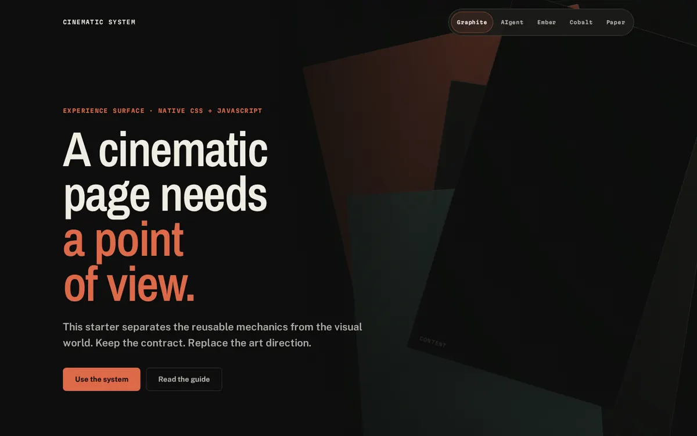
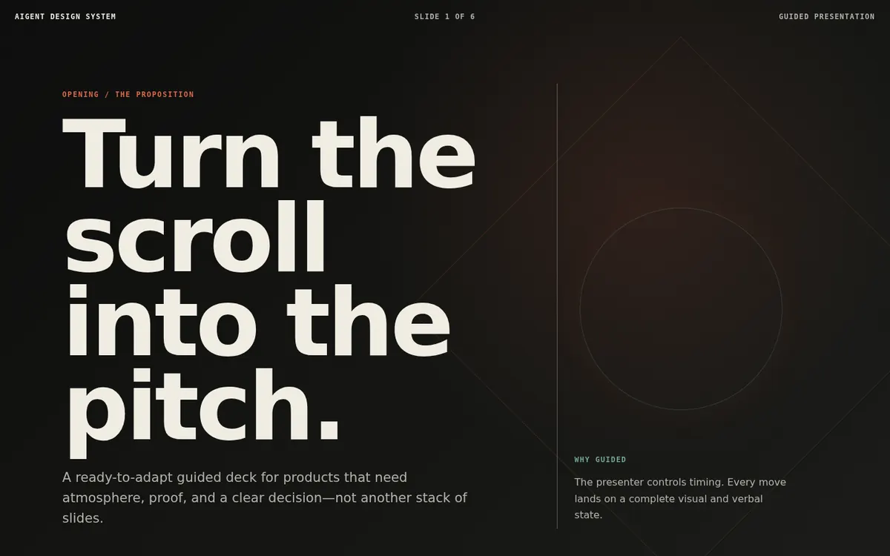
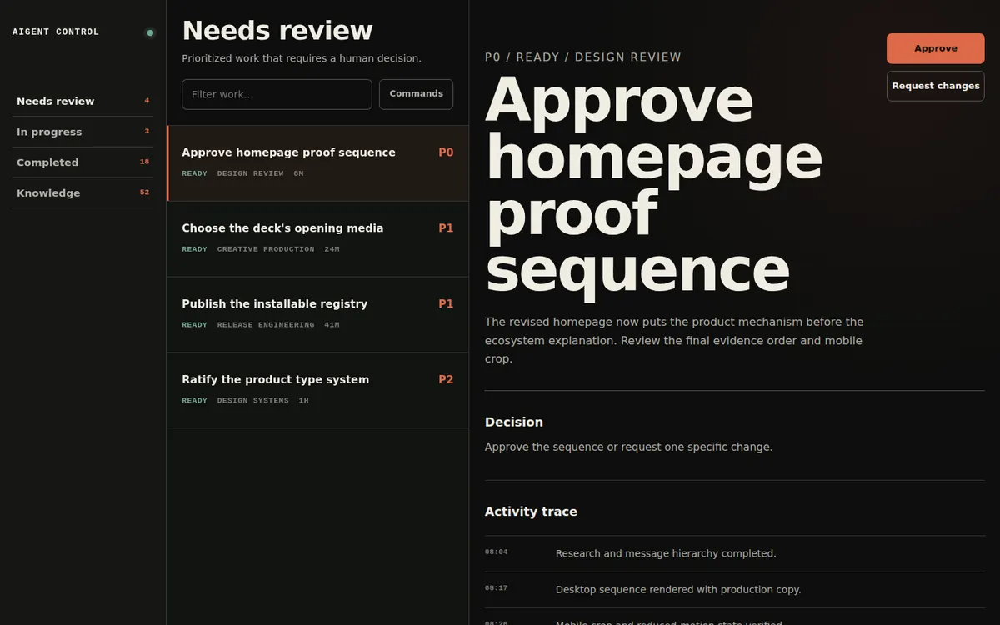
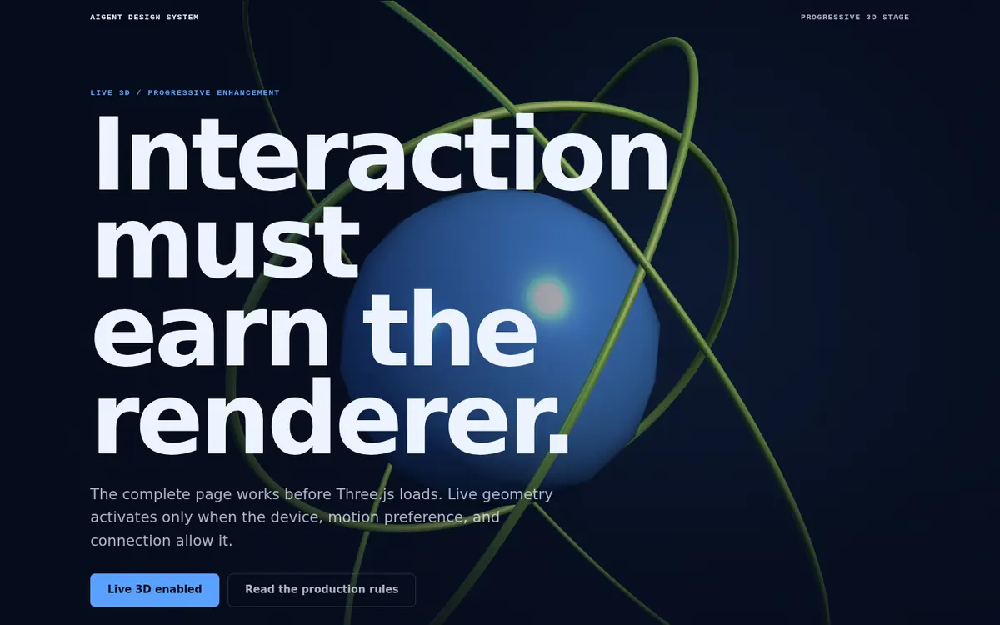

<p align="center">
  
</p>

<p align="center"><strong>Turn Claude, Codex, Cursor, and other coding agents into a design-and-production studio for immersive websites, product interfaces, cinematic decks, and the media behind them.</strong></p>

<p align="center">
  <a href="https://github.com/wrg32786/aigent-design-system/releases/tag/v1.0.0">v1.0.0</a>
  · <a href="https://theaigent.xyz">The AIgent</a>
  · <a href="https://tools.theaigent.xyz">AIgent Tools</a>
  · <a href="#see-it-working">See it working</a>
  · <a href="#license">MIT</a>
</p>

```bash
pnpm dlx shadcn@latest add wrg32786/aigent-design-system/full-studio
```

## AIgent Studio 1.0

AIgent Studio is a **DOM-backed visual website canvas**: the layers, selection boxes, inspector, comments, and agent all operate against the real project running in the browser. There is no disconnected design mockup to translate later.

```bash
npm install
npm run studio -- --open
```

Inside Studio you can:

- click, hover, and multi-select real rendered elements;
- navigate a synchronized semantic layers tree;
- edit text inline and change layout, typography, appearance, position, and responsive overrides;
- resize, reorder, duplicate, remove, and reuse sections as project components;
- browse the project's design tokens;
- undo and redo through a structured Canvas patch journal;
- attach comments directly to elements and see other active Studio participants;
- save and restore local Git checkpoints;
- hand selected elements, open comments, and approved Canvas operations to Claude Code or Codex;
- run Design Intelligence, Inspiration forensics, Resolve, and Vision from the same project.

Direct edits are stored reversibly in `.aigent/studio/canvas.json`. When a direction is approved, **Distill canvas edits into source** asks the authenticated local agent to fold the patch journal into the smallest correct source files. The operator clears the journal only after comparing the real rendered result.

Install Studio into another project:

```bash
pnpm dlx shadcn@latest add wrg32786/aigent-design-system/aigent-studio
node scripts/studio-server.mjs --open
```

Credentials remain in the local Claude Code or Codex CLI. The browser never asks for an API key. Studio is localhost-only by default and does not expose a generic shell endpoint.
AIgent studies references, synthesizes an original direction, sources or produces the media, builds the surface, measures the browser, sees the rendered result, and repairs the highest shared cause.

```text
SHAPE → INSPIRE → SYNTHESIZE → PRODUCE → BUILD → RESOLVE → SEE
```

The neutral core is framework- and dependency-light. GSAP, Three.js, Spline, Remotion, Rive, React Three Fiber, Theatre.js, Blender, FFmpeg, and external component sources are opt-in and used only when the work earns them.

## See it working

### Cinematic page

<p align="center">
  
</p>

A brand-neutral scroll system with authored pacing, responsive composition, and reduced-motion behavior. See [`templates/modular-scroll-starter/`](templates/modular-scroll-starter/).

### Immersive sales deck

<p align="center">
  
</p>

A guided presentation system for sales, sponsorship, launches, and structured product storytelling. See [`templates/immersive-sales-deck/`](templates/immersive-sales-deck/).

### Command center interface

<p align="center">
  
</p>

A dense operator interface with prioritized work, working detail, activity trace, search, and a native command palette. See [`templates/command-center-interface/`](templates/command-center-interface/).

### Progressive Three.js stage

<p align="center">
  
</p>

A complete static fallback with live Three.js loaded only when the device, connection, and motion preference justify it. See [`templates/threejs-product-stage/`](templates/threejs-product-stage/).

More working references:

- [`templates/free-design-stack/`](templates/free-design-stack/) — pinned video narrative
- [`templates/spline-scroll-landing/`](templates/spline-scroll-landing/) — visually authored 3D page
- [`templates/asset-scroll-gallery/`](templates/asset-scroll-gallery/) — editorial resource gallery
- [`vault/`](vault/) — browse, preview, and install systems

## Install only what you need

| System | Includes | Install |
| --- | --- | --- |
| Studio core | product/design contracts, tokens, native motion, primary skill, planner | `pnpm dlx shadcn@latest add wrg32786/aigent-design-system/studio-core` |
| Inspiration Intelligence | URL/file forensics, Design DNA, synthesis, originality review, influence ledger | `pnpm dlx shadcn@latest add wrg32786/aigent-design-system/inspiration-intelligence` |
| Design Resolver | multi-viewport browser evidence, ranked root-cause repair, run comparison | `pnpm dlx shadcn@latest add wrg32786/aigent-design-system/design-resolver` |
| AIgent Vision | annotated captures, structured critique, visual completion gate | `pnpm dlx shadcn@latest add wrg32786/aigent-design-system/vision-critic` |
| Full studio | all design intelligence, production systems, references, skills, and QA | `pnpm dlx shadcn@latest add wrg32786/aigent-design-system/full-studio` |

Complete surfaces:

```bash
pnpm dlx shadcn@latest add wrg32786/aigent-design-system/cinematic-page
pnpm dlx shadcn@latest add wrg32786/aigent-design-system/immersive-sales-deck
pnpm dlx shadcn@latest add wrg32786/aigent-design-system/command-center-interface
pnpm dlx shadcn@latest add wrg32786/aigent-design-system/threejs-product-stage
```

Review an item before installation:

```bash
pnpm dlx shadcn@latest view wrg32786/aigent-design-system/inspiration-intelligence
pnpm dlx shadcn@latest add wrg32786/aigent-design-system/inspiration-intelligence --dry-run
```

## One primary skill

```bash
pnpm dlx shadcn@latest add wrg32786/aigent-design-system/aigent-design-skill
```

The consolidated [`aigent-design`](skills/aigent-design/SKILL.md) skill routes to specialist skills only when needed:

```text
shape · inspire · create · page · deck · interface · asset
layout · typeset · color · animate · critique · polish
resolve · vision · audit · extract · install · eval
```

Product truth and explicit constraints outrank generic taste advice. Inspiration is evidence, not a specification. Mobile is recomposed, not shrunk. Mechanical checks are a floor; rendered visual judgment decides completion.

## Inspiration Intelligence

Inspect a public URL or local reference:

```bash
npx github:wrg32786/aigent-design-system inspire add https://example.com --label example
npx github:wrg32786/aigent-design-system inspire add reference.png
npx github:wrg32786/aigent-design-system inspire add reference.mp4
```

A live URL capture records desktop, tablet, and mobile screenshots; DOM hierarchy and geometry; computed typography and material roles; fixed and sticky regions; media and interaction evidence; animation timing; responsive transformations; and browser errors.

Whole-surface synthesis requires at least three references so no single source controls the result:

```bash
npx github:wrg32786/aigent-design-system inspire compose \
  --brief design-intelligence/example-brief.json \
  --refs structure-source,type-source,motion-source \
  --out .aigent/inspiration-plan.json
```

The output includes a reference matrix, required transformations, source exclusions, AIgent pattern mapping, production requirements, Design DNA, an originality threshold, and an influence ledger. Source copy, assets, marks, exact section order, exact type pairing, exact keyframes, camera paths, and source implementation are never reused.

## AIgent Resolve

AIgent Resolve supplies browser facts:

```text
RENDER → DETECT → RANK → REPAIR → RERENDER → REVIEW
```

```bash
npx github:wrg32786/aigent-design-system resolve --init --target .

npx github:wrg32786/aigent-design-system resolve \
  --target . \
  --url http://127.0.0.1:3000/
```

It checks desktop, tablet, mobile, 200% text sizing, reduced motion, runtime failures, overflow, focus, touch targets, contrast, clipping, media, and request behavior. It ranks one coherent repair group so the agent fixes the shared cause instead of polishing random symptoms.

## AIgent Vision

AIgent Vision requires the operating agent, a human reviewer, or an explicit vision adapter to open every original and annotated capture. A screenshot existing on disk is not proof that the agent saw it.

```bash
npx github:wrg32786/aigent-design-system vision prepare --target .

npx github:wrg32786/aigent-design-system vision check \
  --target . \
  --review .aigent/resolve/latest.visual-review.json

npx github:wrg32786/aigent-design-system vision finalize \
  --target . \
  --review .aigent/resolve/latest.visual-review.json
```

The structured review covers product clarity, hierarchy, composition, typography, color/material, motion/media, interaction, product specificity, originality, responsive quality, trust/usability, and finish. Completion requires a passing mechanical gate, every required viewport reviewed, no open P0/P1 visual finding, and an explicit final verdict.

## Creative production

`creative-production/` covers free and paid asset sources, AI generation, Blender and Remotion rendering, video and GLB optimization, licensing, provenance, mobile derivatives, and reduced-motion fallbacks.

| Requirement | Preferred route |
| --- | --- |
| Controlled visual state | image + CSS |
| Atmospheric movement | short encoded video |
| Exact scroll progression | frame sequence or scrub-ready video |
| Rotatable product | `model-viewer` |
| Visually authored 3D | Spline |
| Live shaders, geometry, or manipulation | Three.js |
| Programmatic multi-format media | Remotion render |
| Photoreal fixed-camera scene | Blender render |
| Interactive vector state | Rive |

External primitives and components are selected from curated sources such as shadcn/ui, Radix Primitives, Base UI, Ark UI, Floating UI, Motion Primitives, Magic UI, React Bits, and TanStack Virtual. Install only what the project needs and restyle it into one visual world.

## Verification

Validated release contract for `v0.6.0`:

| Contract | Current proof |
| --- | ---: |
| Installable registry items | **15** |
| Agent skills | **23** |
| Layout / type / motion systems | **15 / 8 / 14** |
| Curated component sources | **10** |
| Creative resources / integrations | **31 / 8** |
| Resolve on canonical starter | **100/100 · 0 errors · 0 warnings** |
| Vision review | **4 viewports · 12 dimensions · no open P0/P1** |

```bash
npm run catalogs
npm run assets
npm run intelligence
npm run inspiration
npm run resolve:check
npm run vision:check
npm run registry
npm run eval
npm run audit -- path/to/page path/to/shared.css
npm run check
npm run smoke
npm run inspiration:smoke
npm run capture
```

GitHub Actions validates the registry, clean installer, planner, Inspiration Intelligence, AIgent Resolve, AIgent Vision, evals, browser matrix, URL-forensics fixture, Inspiration Lab, and visual captures.

## Local development

```bash
npm install
npx playwright install chromium
npm run serve
```

Open:

```text
http://127.0.0.1:4177/
http://127.0.0.1:4177/vault/
http://127.0.0.1:4177/inspiration/lab/
```

<details>
<summary><strong>Repository architecture</strong></summary>

```text
PRODUCT.md
DESIGN.md
registry.json

design-intelligence/    deterministic design decisions
inspiration/            forensics, Design DNA, synthesis, originality, lab
creative-production/    media sources, briefs, pipelines, standards
patterns/                ready-to-use interactions
templates/               complete reference surfaces
resolve/                 ranked mechanical render-repair contract
vision/                  annotated captures and structured visual critique
assets/                  provenance manifests and optimized outputs
integrations/            optional runtime guidance
recipes/                 production recipes
skills/                  primary and specialist agent skills
evals/                   fixed briefs and scoring contracts
case-studies/            production decision maps
vault/                   visual install catalog
scripts/                 CLI, planner, audits, checks, browser proof
tokens/                  semantic visual system
modules/                 dependency-free motion core
```

</details>

## Production proof

- **[theaigent.xyz](https://theaigent.xyz)** — cinematic Persuade + Experience surface
- **[tools.theaigent.xyz](https://tools.theaigent.xyz)** — dense Operate + Read surface

They set the craft bar. They are not universal templates or palettes. The reusable core remains brand-neutral; the AIgent visual language is one included preset.

## Third-party material

The repository links to external code, assets, references, and services but does not vendor them unless redistribution rights are clear. Read [`THIRD_PARTY.md`](THIRD_PARTY.md) and verify the active license and terms before use.

## License

MIT for AIgent-authored code and documentation.
