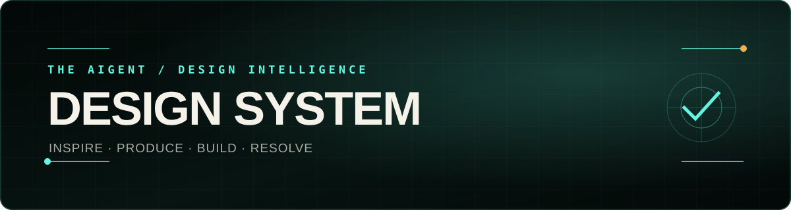

<p align="center">
  
</p>

<h1 align="center">AIgent Design System</h1>

<p align="center"><strong>The agent-native design and production studio for distinctive interfaces, immersive 3D websites, cinematic decks, and the media behind them.</strong></p>

<p align="center"><code>SHAPE · INSPIRE · SYNTHESIZE · PRODUCE · BUILD · RESOLVE</code></p>

An installable system for turning Claude, Codex, Cursor, and other coding agents into a disciplined design-and-production team—with reference forensics, original synthesis, media pipelines, ranked repair, and browser proof.

The system is built to make Claude, Codex, Cursor, and other coding agents operate more like a senior design-and-production team:

```text
SHAPE → INSPIRE → SYNTHESIZE → PRODUCE → BUILD → RESOLVE
```

The neutral core remains framework- and dependency-light. Playwright is used for development-time browser evidence. GSAP, Three.js, Spline, Remotion, Rive, React Three Fiber, Theatre.js, Blender, FFmpeg, and external component sources are selected only when the work earns them.

## Production proof

- **[The AIgent](https://theaigent.xyz)** — cinematic Persuade + Experience surface.
- **[The AIgent Tools](https://tools.theaigent.xyz)** — dense Operate + Read surface.

They set the craft bar. They are not a universal palette or template.

## Instant install

### Studio core

```bash
pnpm dlx shadcn@latest add wrg32786/aigent-design-system/studio-core
```

##

## Inspiration Intelligence

```bash
pnpm dlx shadcn@latest add wrg32786/aigent-design-system/inspiration-intelligence
```

### Complete studio

```bash
pnpm dlx shadcn@latest add wrg32786/aigent-design-system/full-studio
```

### Design Resolver

```bash
pnpm dlx shadcn@latest add wrg32786/aigent-design-system/design-resolver
```

### Complete pages and interfaces

```bash
pnpm dlx shadcn@latest add wrg32786/aigent-design-system/cinematic-page
pnpm dlx shadcn@latest add wrg32786/aigent-design-system/immersive-sales-deck
pnpm dlx shadcn@latest add wrg32786/aigent-design-system/command-center-interface
pnpm dlx shadcn@latest add wrg32786/aigent-design-system/threejs-product-stage
```

Review an item before installing:

```bash
pnpm dlx shadcn@latest view wrg32786/aigent-design-system/inspiration-intelligence
pnpm dlx shadcn@latest add wrg32786/aigent-design-system/inspiration-intelligence --dry-run
```

## Repository CLI

```bash
npx github:wrg32786/aigent-design-system list
npx github:wrg32786/aigent-design-system add studio-core --target .
npx github:wrg32786/aigent-design-system plan brief.json --out design-plan.json
npx github:wrg32786/aigent-design-system inspire doctor
npx github:wrg32786/aigent-design-system resolve --init --target .
```

## AIgent Resolve

Resolve is the final production loop:

```text
RENDER → DETECT → RANK → REPAIR → RERENDER → REVIEW
```

It combines source-level audits with desktop, tablet, mobile, 200% text-size, reduced-motion, runtime, focus, touch-target, contrast, overflow, clipping, and media evidence. It ranks the top repair group, records what must be preserved, and compares every run so Claude fixes the shared cause instead of polishing random symptoms.

Initialize a project once:

```bash
npx github:wrg32786/aigent-design-system resolve --init --target .
```

Run it against a live local application:

```bash
npx github:wrg32786/aigent-design-system resolve \
  --target . \
  --url http://127.0.0.1:3000/
```

The default gate requires a score of 90, zero errors, no more than five warnings, and an explicit visual review. Generated evidence stays under `.aigent/resolve/`. Mechanical passage does not replace judgment about product clarity, specificity, composition, typography, motion, media, originality, or finish.

## Inspiration Intelligence

Inspiration Intelligence gives an agent a disciplined way to inspect references and synthesize an original direction.

It is not a website-cloning command.

### Add a live URL

```bash
npx github:wrg32786/aigent-design-system inspire add \
  https://example.com \
  --label example
```

A URL capture records:

- desktop, tablet, and mobile screenshots
- full-page screenshots and a scroll filmstrip
- visible DOM hierarchy and geometry
- computed visual roles
- typography and material evidence
- fixed and sticky regions
- interactions and media
- Web Animations timing and keyframes
- Chrome DOMSnapshot node and layout evidence
- responsive transformations
- network and page errors

It produces:

```text
.aigent/inspiration/sources/<id>/
  source.json
  design-dna.json
  report.html
  captures/
  evidence/
```

`.aigent/` is ignored by Git so third-party screenshots, private references, and extracted page evidence do not enter the public repository accidentally.

### Add screenshots, video, Figma exports, or structured references

```bash
npx github:wrg32786/aigent-design-system inspire add reference.png

npx github:wrg32786/aigent-design-system inspire add reference.mp4

npx github:wrg32786/aigent-design-system inspire add reference.json \
  --kind structured-reference \
  --analysis reference.json
```

File metadata alone cannot prove layout, exact typography, responsive behavior, interactions, or animation timing. Supply a Design DNA annotation when the source has no inspectable URL. FFmpeg filmstrips are generated when FFmpeg and ffprobe are available.

### Search the local library

```bash
npx github:wrg32786/aigent-design-system inspire list
npx github:wrg32786/aigent-design-system inspire inspect example --summary
npx github:wrg32786/aigent-design-system inspire search \
  "editorial command center restrained motion"
```

### Compose a new direction

Whole-surface synthesis requires at least three references so no source controls more than two design dimensions.

```bash
npx github:wrg32786/aigent-design-system inspire compose \
  --brief design-intelligence/example-brief.json \
  --refs structure-source,type-source,motion-source \
  --out .aigent/inspiration-plan.json
```

The result includes:

- reference matrix
- required transformation per dimension
- explicit source exclusions
- AIgent pattern mapping
- production requirements
- influence ledger
- originality threshold
- `DIRECTION.md`

The six dimensions are:

```text
structure
 typography
 material
 motion
 interaction
 media
```

Apply the plan to a target project:

```bash
npx github:wrg32786/aigent-design-system inspire apply \
  .aigent/inspiration-plan.json \
  --target .
```

### Originality audit

```bash
npx github:wrg32786/aigent-design-system inspire audit \
  --target-dna .aigent/target-design-dna.json \
  --plan .aigent/inspiration-plan.json \
  --refs structure-source,type-source,motion-source
```

The audit compares normalized structure, typography, material, motion, interaction, media, and copy fingerprints. It flags source dominance and weak transformation. It is a design-review heuristic, not a legal conclusion.

Always exclude:

- source copy and claims
- source photographs, footage, 3D assets, audio, icons, logos, and marks
- exact section order
- exact type pairing and scale
- exact animation timing, keyframes, or camera path
- source HTML, CSS, JavaScript, shaders, and private implementation

Open `inspiration/lab/` locally to explore the reference-matrix workflow.

## The design brain

`design-intelligence/` converts a product brief into a deterministic starting plan instead of allowing every agent to fall back to the same hero, card grid, typeface, and animation.

It includes:

- 15 layout grammars
- 8 typography systems
- 14 motion systems
- 5 interface systems
- 10 curated external component sources
- seeded exploration and conventional fallback
- runtime, media, mobile, anti-pattern, and verification decisions

```bash
npm run plan -- design-intelligence/example-brief.json --out design-plan.json
```

The planner does not replace taste. It makes the starting decisions inspectable.

## One Claude skill, specialist depth

```bash
pnpm dlx shadcn@latest add wrg32786/aigent-design-system/aigent-design-skill
```

The consolidated `aigent-design` skill handles:

```text
shape      define the product and design brief
inspire    inspect references and synthesize an original direction
create     create or replace a visual world
page       build a marketing, editorial, or experience page
deck       build a guided immersive deck
interface  build product UI with complete states
asset      source, generate, render, and optimize media
layout     repair hierarchy, grouping, density, and responsive structure
typeset    establish role-based typography
color      establish palette, material, contrast, and semantic roles
animate    author focal motion and useful state transitions
critique   identify the highest-value design failures
polish     finish the rendered result
resolve    render, rank, repair, rerender, and verify the complete surface
extract    turn proven patterns into reusable assets
audit      run mechanical, inspiration, asset, and browser checks
install    choose and install the smallest useful system
eval       score a finished result without inventing taste
```

Specialist skills own design forensics, reference synthesis, originality review, video, 3D, GSAP, Spline, Remotion, provenance, and final browser QA.

## Complete reference systems

| System | Surface | Runtime |
| --- | --- | --- |
| `templates/modular-scroll-starter/` | Brand-neutral cinematic page | Native CSS + JavaScript |
| `templates/immersive-sales-deck/` | Guided sales and sponsorship deck | Native JavaScript |
| `templates/command-center-interface/` | Operator command center | Native product UI |
| `templates/threejs-product-stage/` | Progressive live 3D product stage | Three.js loaded on demand |
| `templates/free-design-stack/` | Pinned video narrative | GSAP + encoded video |
| `templates/spline-scroll-landing/` | Visually authored 3D page | Spline + GSAP |
| `templates/asset-scroll-gallery/` | Editorial resource gallery | Spline + native JavaScript |

## Ready-to-use patterns

| Pattern | Job |
| --- | --- |
| `guided-deck` | Chapter navigation, focus, keyboard control, and progress |
| `command-palette` | Native dialog search and command events |
| `focus-reveal` | Bounded blur, mask, and focus material reveal |
| `scene-stage` | Global, chapter, and local scroll progress |
| `object-stage` | Progressive model-viewer, Spline, or Three.js loading |

## Component sources without visual soup

The system uses mature accessible primitives before rebuilding standard behavior. The catalog includes shadcn/ui, Radix Primitives, Base UI, Ark UI, Floating UI, Motion Primitives, Magic UI, React Bits, TanStack Virtual, and others.

Rules:

1. Install only the primitive that solves the task.
2. Restyle it into one typography, spacing, material, icon, and state system.
3. Do not mix several libraries' default visual skins.
4. Verify the active source license before redistribution or commercial use.
5. External components accelerate engineering; they do not choose the visual world.

## Creative production

`creative-production/` covers:

- free and paid video, VFX, 3D, texture, HDRI, audio, and generation sources
- hero, scene, object, and frame-sequence briefs
- Blender, Remotion, video, and GLB pipelines
- mobile derivatives and reduced-motion fallbacks
- licensing, provenance, and performance budgets

Use the lightest medium that carries the idea:

| Requirement | Preferred route |
| --- | --- |
| Controlled visual state | Image + CSS |
| Atmospheric movement | Short encoded video |
| Exact scroll progression | Frame sequence or scrub-ready video |
| Rotatable product | model-viewer |
| Visually authored 3D | Spline |
| Live shaders, geometry, or manipulation | Three.js |
| Programmatic multi-format media | Remotion render |
| Photoreal fixed-camera scene | Blender render |
| Interactive vector state | Rive |

## Evals

The existing design benchmark separates mechanical evidence from human design judgment. `inspiration/evals/` adds InspirationBench with three conditions:

1. no references
2. raw references in the prompt
3. Design DNA, reference matrix, transformations, and influence ledger

The target is not visual similarity. Reviewers score correct principle extraction, product fit, originality, responsive finish, and implementation quality.

## Verification

```bash
npm run catalogs
npm run assets
npm run intelligence
npm run inspiration
npm run resolve:check
npm run registry
npm run eval
npm run audit -- path/to/page path/to/shared.css
npm run check
npm run smoke
npm run inspiration:smoke
npm run capture
```

GitHub Actions validates the registry, local installer, design planner, inspiration engine, Resolve self-check and rendered proof, evals, desktop/mobile browser behavior, a real URL-forensics fixture, the Inspiration Lab, and reviewable visual captures.

## Local development

```bash
npm install
npx playwright install chromium
npm run serve
```

Open:

```text
http://127.0.0.1:4177/
http://127.0.0.1:4177/vault/
http://127.0.0.1:4177/inspiration/lab/
```

## Architecture

```text
PRODUCT.md
DESIGN.md
registry.json

design-intelligence/    deterministic design decisions
inspiration/            forensics, Design DNA, synthesis, originality, lab
resolve/                ranked render-repair-verification contract
creative-production/    media sources, briefs, pipelines, standards
assets/                  manifests and optimized public outputs
integrations/            optional runtime guidance
patterns/                ready-to-use interactions
recipes/                 production recipes
templates/               complete reference surfaces
skills/                  umbrella and specialist agent skills
evals/                   fixed design briefs and scoring contract
case-studies/            production decision maps
vault/                   visual install catalog
scripts/                 planner, CLI, audits, checks, browser proof
tokens/                  semantic visual system
modules/                 dependency-free motion core
```

## Reuse rule

Extract a public token, pattern, recipe, or skill only after the same intent appears in multiple real surfaces. Inspiration evidence remains local unless the source and redistribution rights are explicitly clear.

## Third-party material

The repository links to external code, assets, references, and services but does not vendor them unless redistribution rights are clear. Read `THIRD_PARTY.md` and verify the exact license and terms active when you use an external source.

## License

MIT for AIgent-authored code and documentation.
